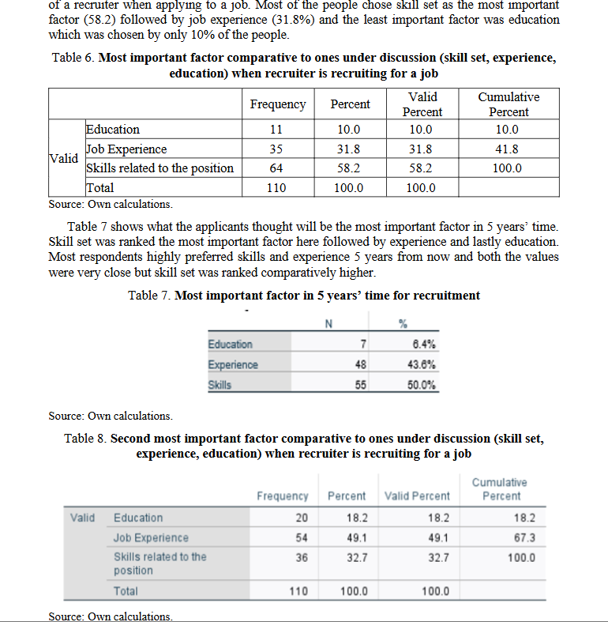

<meta name="viewport" content="width=device-width, initial-scale=1.0, maximum-scale=1.0, user-scalable=no, shrink-to-fit=no, viewport-fit=cover">

### Technical Analyst

📍 Hungary, Europe

Hey, I'm Anoosha. I'm a Technical Support Analyst and Senior Support Specialist with 4+ years in leading multinational billion dollar firms in growing their customer base by atleast 20% | Saved $500K through effective cost management | Ex-Financial Analyst @ Ittefaq Group | Ex-Senior Support Specialist @ Fossil Group Inc. | Operation Team Leader | Customer Service Sales Specialist | BBA @ UoD (1st Class Honours)

---

#### 📚 Education 

| Degree | Institution | Year |
|:------:|:----------:|:----:|
| BSc., Business Administration and Management | University of Debrecen | 1st Class Honours 
| Cambridge International A Level Examination | LGS | A*, A, B

---

#### 🎯 Skills 

* **Core Competencies**: IBM, SPSS, SAP, SQL, Tableu, Salesforce, Microsoft Suite, Excel, Spreadsheets, CRM, ERP, Power BI.

* **Soft Skills**: Verbal Communication, Compassionate, Multi-tasking, Result Oriented, Organised, Issue Resolving, Teamwork, Detail Oriented.

---
#### ✨ 7. Key Achievements 

1. Streamlined SAP order management systems and enhanced client servicing through CRM platforms, safeguarding more than $150K+ worth of supply chain and customer operations, being a Senior Support Specialist @ Fossil Group.

2. Optimised operational workflows through Salesforce dashboards and Power BI tools, generating  additional $20K in ARR in less than 3 months by a 12% increase in sales targets and 22% growth in lead conversions.

3. Resolved 3000+ hardware/software issues monthly for US and Canada clients using CRM/ERP platforms, boosting system reliability and user satisfaction by 90%. 

4. Supervised 25+ employees to in processing 100+ orders weekly via SAP and CyberSource, boosting order fulfillment speed by 15%.

5. Negotiated vendor contracts and optimized procurement workflows, achieving 20% budget saving (approximately $50K).

6. Consistently maintained 90%+ SLA/KPI adherence, and supported over $200K+ worth of customer operations with high efficiency and technical precision as Technical Support Analyst @ EcoFlow.

7. Maintained 100% financial record accuracy, and streamlined payment operations using Moneris and Authorize.Net, cutting operational costs by 10% @ Ittefaq Group.

---

#### 💼 Professional Experience 

**Technical Support Analyst and Operations Specialist @ Ecoflow (October 2023 - Present)**  

EcoFlow serves 4.5M+ customers across 100+ countries, with $1B+ valuation, nearly $1B revenue, 1,200+ employees, and award-winning innovations like TIME's "Best Inventions of 2021."

**📌 Responsibilities** 
* Proficiently resolving customer-reported issues with CRM and ERP systems, consistently achieving over 90% in SLA and KPI adherence. 

* Diagnose and troubleshoot more than 50 hardware and software issues daily, enhancing system reliability and user satisfaction for our international clientele in the United States and Canada by 90%. 

* Facilitated cross-regional collaboration with peers, leading to a 50% increase in the rate of successful technology adaptation to meet evolving partner needs. 

**Financial Analyst @ Ittefaq Group (Jun 2023 - Sep 2023)**  

Ittefaq Group, a leader in the construction and steel industries has annual revenue of $100+ million with 1000+ employees. The company's commitment to quality and innovation has solidified its reputation as a key player in construction sector.

**📌 Responsibilities** 
* Negotiated and managed vendor contracts with strategic sourcing methods, securing cost-effective procurement of IT resources, which led to a 20% budget saving. 

* This involved conducting market research, leveraging bulk purchasing, and fostering long-term partnerships to ensure competitive pricing and quality service delivery. 

* Managed up-to-date financial records with 100% accuracy overseeing both payable and receivable accounts to ensure utmost data accuracy and compliance with financial regulations, reducing financial reporting errors by 10%. 

* Spearheaded initiatives to optimize payment workflows and operations using Moneris and Authorize.Net softwares, achieving an improvement of reduced operational costs by 10%. 

* Contributed to HR administration by streamlining workflow processes, leading to departmental efficiency.

*  My support for various HR initiatives resulted in a 20% improvement in employee satisfaction. 

**Seasonal Operation Team Leader @ Fossil Group (Mar 2023 - Sep 2023)**  

Fossil Group, Inc. operates in 140+ countries with 30,000+ distribution points, $1.4B+ revenue, 6,000+ employees, and leads global fashion with brands like Michael Kors, Diesel, BMW, and Emporio Armani.

**📌 Responsibilities** 
* Customized Salesforce dashboards and reports, working closely with sales teams to understand their needs and providing them with tailored tools. 

* This initiative led to a 12% increase in sales targets and improved client follow-up response times by 20%. 

* Monitored and supervised the performance of over 25 employees, implementing performance management strategies that resulted in a 15% increase in productivity while fostering a supportive and collaborative work environment. 

* Engineered Customized Salesforce, CRM and Power BI solutions to track customer engagement metrics, driving a 22% growth in lead conversion rates. 

**Senior Support Specialist @ Fossil Group (Sep 2022 - February 2023)**  

Fossil Group, Inc. operates in 140+ countries with 30,000+ distribution points, $1.4B+ revenue, 6,000+ employees, and leads global fashion with brands like Michael Kors, Diesel, BMW, and Emporio Armani.

**📌 Responsibilities** 
* Mobilized SAP and Cyber Source software to manage customer request efficiently by processing of over 100 orders per week, utilizing my skills in SAP software to organize and manage customer requests efficiently. 

* These efforts led to a significant reduction in processing errors by 50%.

* Acted as a bridge between finance and sales department by initializing an average of 120+ tickets/day to resolve client requests by fetching logs and orchestrated strong client relationships via CRM. 

* Overhauled SAP order management systems, customizing functionalities to better align with business needs. 

* This resulted in a 15% increase in order fulfillment speed, and a 5% boost in supply chain efficiency. 

* Engineered SPSS to enhance reporting, analysis, aided by full-fledge individual, client reports leading to a ~20%+ increase in operational efficiency whilst managing cash-to-quote processes. 

**Operations Intern @ WWF (Jun 2017 - Aug 2017)**  

WWF is one of the world's largest conservation organizations, active in over 130 countries with 5 million+ supporters. With annual revenues over $350 million, it leads global efforts in wildlife protection, habitat conservation, and climate change advocacy.

**📌 Responsibilities** 
* Coordinated logistics for 15+ city-wide food drives, ensuring timely collection and distribution of 10,000 € of food.

* Managed partnerships with 100+ businesses to secure food donations, optimizing supply chain processes for efficiency.

* Led a team to win 1st place out of 50 teams by driving operational excellence and exceeding target goals.

* Documented and analyzed food conservation impact, influencing 50,000+ individuals through targeted awareness campaigns.

* Maintained high operational efficiency and team morale, ensuring smooth event execution under tight deadlines.

---
#### 📑 Featured Publication 

Signaling and Screening in Employee Selection: Skill, Education, or Experience

Featured in the Open Journal System (OJS) at Debreceni Egyetem, that hosts the top 5% publications on business, economics, and management sciences.

* **Description**:This  study  examines  the importance of three factors—abilities, work experience, and education—that serve as indicators and filters in the selection process. It aims to determine how current job market entrants perceive the importance of these three factors from the perspective of employers.

* **Key Findings**: The key finding is that respondents consider skills to be the most important, followed by experience, with education playinga secondary role

---

#### 🏆 Awards & Honours 

* **Dean's Honour List (University of Debrecen)** 
  4.67/5 GPA in Business Administration BSc.

* **Exceeding targets and operational excellency (WWF)** 
  Awarded 1st place of 50 teams in exceeding set targets and KPIs.

---

#### 🚀 Transferable Extracurriculars 

**Vice President Business Society (LGS)** 
* Led a team of 30 members to drive business-focused initiatives and enhance society growth.
* Organized 5 business events, drawing over 200 students and professionals.
* Managed event budgets, achieving a 20% reduction in overall costs.
* Led partnerships with 20+ local businesses, securing internships and mentorship opportunities for students.
* Boosted membership by 30% through strategic marketing and recruitment campaigns.

**Vice President Business Society (LGS)** 
* Led a team of 20 members, fostering innovation and collaboration in robotics projects and events.
* Organized 5+ robotics competitions, attracting over 100 participants and sponsors.
* Coordinated robotics workshops, improving student participation and skills by 40%.

---

#### 🌍 Volunteering 

**Intern (Rising Sun Institute for Special Children)** 
* Fundraised $5000 for special needs children through a 15 days door to door campaign.
* Supported over 30 children in the daily activities of special children
* Developed and tracked progress for 15 children, ensuring their developmental milestones were achieved in line with school objectives.
* Organized 20+ weekly recreational activities, boosting children’s motor skills by 10% over a 6-month period.

**Academic Support Intern (Shaheera Foundation)** 
* Assisted in teaching vocational and social skills, benefiting 30+ students.
* Utilized innovative teaching methods for teaching English and Maths, increasing student engagement by 25%.
* Provided tailored 1-1 training sessions for children with special needs.

---

#### Contact 📞

* **LinkedIn**: [Anoosha Tariq](https://www.linkedin.com/in/anoosha-tariq-sahi){:rel="noopener noreferrer"}
* **Email**: anooshy10@gmail.com

---

_This portfolio is constantly updated with new analyses. Check back regularly for updates._
